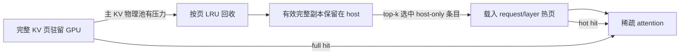

KVDuo 是面向原生稀疏注意力模型的 KV Cache 管理方案。它优先让完整 KV 驻留在 GPU；只有主稀疏 KV 物理池出现分配压力时，才回收已有最新 host 副本的冷页。稀疏注意力再次选中这些页中的条目时，resolver 按 layer 将条目载入 GPU 热页。

这种设计将普通 decode 保持在完整 KV 路径上，并在显存不足后切换为完整页、host 副本和按层热条目共存的混合驻留，从而减少整请求 retract 后重复 prefill 的开销。

## 内存模型

### 统一的 GPU 物理池

KVDuo 在主稀疏 KV 物理池中复用两种 GPU 存储：

- **完整页（full page）**：跨所有稀疏 attention layer 保存一段连续上下文的完整 KV。逻辑位置通过 full-to-physical 映射找到它。
- **热页片段（hot page fragment）**：归属一个 `(request, layer)`，保存 resolver 最近需要的条目。

底层 allocator 仍按跨 layer 的物理页分配 carrier。KVDuo 在 carrier 上逐 layer 记录所有权，因此空闲 layer 片段可独立复用；只有所有 layer 片段都空闲后，carrier 才整体返回 allocator。热页与完整页共享物理地址空间，但所有权不会重叠。



### 控制面与 CUDA 镜像

控制面维护完整页的 generation、data version、host version、最近访问时间、pin 和所有权。固定地址的 CUDA tensor 镜像向 graph replay 和 fused resolver 提供 full 映射、热页容量、LRU 槽位与统计信息；它们不是第二套所有权来源。

异步 writeback 只有在 generation 和 data version 仍匹配时才能发布 host version。这样，地址复用或原地更新后完成的旧 DMA 不会把过期 host 数据标记为有效。

## 请求生命周期

### 1. Prefill、备份与发布

Prefill 先产生完整 KV，并通过独立 CUDA stream 将数据备份到 pinned host pool。只有写满并完成备份的页才可成为回收候选；正在追加的尾页不会被当作稳定 host 副本。

Chunked prefill 支持保持开启。未完成的 chunk 仍由 request 持有，不会提前发布到 RadixTree；请求完成相应状态转换后，连续且完整驻留的前缀才进入 GPU prefix cache。

### 2. 完整驻留 decode

请求进入 decode 时不会预留热页，也不会为了迁移到 KVDuo 而复制或降级完整 KV。新 token 继续写入完整页；页封口后异步建立 host 副本。只要完整页没有被回收，resolver 直接返回 full 映射。

### 3. 物理池压力与降级

decode 新页、host 前缀恢复或必需热页即将分配时，KVDuo 按实际跨 layer 页字节数检查**主稀疏 KV 物理 allocator**。它不会使用 composite allocator 的最小可用量来推断压力，因为逻辑 token slot、SWA、indexer KV 和 compression state 分别由其他分配路径管理。

发生缺口时，处理顺序如下：

1. 等待需要完成的 producer/writeback 工作，并收集可回收的完整页。
2. 排除 Radix 前缀、当前分配显式保护的位置、请求最新的 `tail_protected_pages` 个页、未写满页，以及 host version 不是最新 data version 的页。
3. 按页内条目的最大最近访问时间执行全局页级 LRU；相同时间使用 request 和页偏移稳定排序。
4. 清除被选页的 full 映射并将物理页返回 allocator；对应请求从此进入混合驻留。
5. 完整页不足时，再按 LRU 回收**高于必需下限**的热页片段。必需的 `2 × top_k` 容量不会作为普通热页牺牲。

一次真实物理分配只有在压力计划重新检查为 `SUCCESS` 后才能继续。无法取得所需页时会返回明确的压力原因或终止该分配，不会带着部分更新的元数据继续执行。

### 4. 稀疏解析与热页

模型为每层产生 top-k 逻辑位置后，resolver 按以下顺序解析：

- **full hit**：逻辑位置仍有完整页映射，直接使用该物理地址。
- **hot hit**：复用当前 `(request, layer)` 热集合中的条目，并更新 LRU。
- **host miss**：从该位置的 pinned host 副本载入一个 layer 的 KV，优先使用空槽，否则替换最旧热条目。

请求在首次完整页降级前保持零热页容量。进入混合驻留后，下一次 graph replay 前必须为每个 storage group 建立至少 `2 × top_k`、按页对齐的容量；压力处理如果又降级了其他请求，控制面会迭代到所有混合请求都满足此不变量。

resolver 元数据的地址与最大宽度固定为 `16 × top_k`，以保持 CUDA graph 稳定，但物理页仍按需获取：

- 工作集立即需要更多槽位时，从 `2K`、`4K`、`8K`、`16K` tier 中前进一步。
- 控制面每 8 次 replay 异步快照 host miss/valid access 计数。观察窗口内 host miss 至少为 `top_k` 且 miss rate 至少为 12.5% 时，才尝试按 `2K` 线性增长（`2K → 4K → 6K → … → 16K`）。
- 统计驱动的可选扩容只使用已有空闲 layer 片段或空闲物理 carrier，不会为了可选收益回收完整页。

## Host 前缀缓存与恢复

RadixTree 只表示连续 GPU 前缀，不能表示中间含 host-only 空洞的请求。KVDuo 另外维护容量受限的 host prefix cache：

- 页 identity 由 namespace、父页 identity 和当前 token chunk 构成，可在请求槽位复用后继续标识内容。
- record 保存每个 KV domain 的 host 地址与版本，并分别跟踪 request 引用、cache 引用、restore pin 和 DMA pin。
- 无引用且无 pin 的 record 才能按 LRU 淘汰；前缀匹配沿连续且版本有效的页链扩展，遇到第一个缺页或旧版本即停止。

host-only 命中不会直接交给 attention。调度器先为恢复建立 commitment 并 pin 住源 record，然后为缺失的完整页预留 GPU 资源、执行 H2D、发布 full 映射，最后释放 restore pin。资源暂时不足时恢复会延后，避免暴露半恢复的前缀。

Tensor parallel 场景下，各 rank 的 GPU 与 host 淘汰可能不同。KVDuo 会协商所有 rank 都能达到的 host 前缀终点；如果仅 GPU 命中长度不同，则重新匹配共同 GPU 前缀。所有 rank 最终以相同前缀长度进入执行。

请求结束时，只有连续、完整且版本有效的页能保留为 host 前缀。混合请求中 RadixTree 无法表达的 request-owned GPU 碎片会被释放。

## 不变量与管理边界

当前实现依赖以下不变量：

- 只有完整、页对齐、host 副本版本最新且未受保护的 full page 可以回收。
- 完整驻留请求不持有投机热页；混合请求在 replay 前必须拥有必需的 `2K` 热容量。
- full page 优先于可选 hot page 成为压力牺牲者；热页不能缩到必需下限以下。
- prefix restore 期间源 host record 被 pin，发布前不能被淘汰。
- KVDuo 只解决主稀疏 KV 物理池压力；其他资源短缺仍由对应 allocator 或 scheduler 处理。

KVDuo 复用 HiSparse 的 host pool、稀疏 selector、resolver 和部分 allocator 接口，但改变了驻留策略：HiSparse 的共享配置由 KVDuo 在启动时生成，完整 KV 不会从一开始就被限制在固定 device buffer 中。

## 适用场景与限制

适合：

- 原生支持稀疏 KV 选择和当前 resolver/backend 的模型；
- 长上下文、高并发 decode，且主要瓶颈是主稀疏 KV 物理池；
- 工作集具有时间局部性，host pinned memory 容量和 H2D 带宽足够；
- 希望用页级降级代替整请求 retract 和重复 prefill。

不适合：

- 稠密注意力模型或没有受支持 selector/backend 的模型；
- 短上下文、低并发，完整 KV 可长期驻留 GPU；
- 瓶颈来自权重、计算、workspace、逻辑 token、SWA、indexer KV 或 compression state；
- 必须使用 speculative decoding、HiCache 或关闭 Radix cache。

## 启动与配置

在 NVIDIA CUDA 环境中，将 `MODEL_PATH` 替换为受支持的稀疏注意力模型：

```bash
python3 -m sglang.launch_server \
    --model-path MODEL_PATH \
    --tp-size 8 \
    --enable-kvduo \
    --kvduo-config='{"top_k": 2048, "host_to_device_ratio": 2, "swap_in_block_size": 960, "tail_protected_pages": 2}'
```

| 参数 | 默认值 | 作用 |
| --- | ---: | --- |
| `top_k` | `2048` | 每层 resolver 返回的条目数；模型提供 `index_topk` 时以模型配置为准。 |
| `host_to_device_ratio` | `2` | host pool 相对 device pool 的容量比例。 |
| `swap_in_block_size` | `960` | resolver CUDA thread block 的线程数，不是一次 H2D 搬运的 KV 条目数；范围为 1–1024。 |
| `tail_protected_pages` | `2` | 每个请求不参与完整页回收的最新页数量。 |

所有字段必须是正整数，未知字段会报错。`--kvduo-config` 必须与 `--enable-kvduo` 一起使用。

KVDuo 要求启用 RadixTree，且不能与 `--enable-hisparse`、`--enable-hierarchical-cache` 或 speculative decoding 同时启用。KVDuo 支持 chunked prefill；启用它不会改写 `--chunked-prefill-size`。

## 评估重点

逐步增加上下文长度和并发，并同时观察：

- token throughput、TTFT、TPOT 和端到端延迟；
- retract/preemption 与重复 prefill token 数；
- 完整页、按 layer 热页片段、carrier 和 host pool 的占用；
- full/hot/host 命中分布、resolver host miss rate 和 H2D 带宽；
- 因主 KV 之外的资源不足导致的 admission 失败。

如果并发容量没有提高，先确认限制来自主稀疏 KV 物理池。如果 host miss rate 持续偏高，再检查 top-k 的时间局部性、热页可选扩容是否受物理压力限制，以及 H2D 是否成为瓶颈。

## 相关文档

- [HiSparse 指南](/docs/advanced_features/hisparse_guide)
