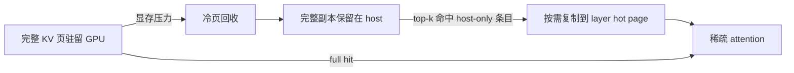

KVDuo 是面向原生稀疏注意力模型的 KV Cache 管理方案。它让完整 KV 在显存充足时驻留 GPU；显存不足时，再把有最新 host 副本的冷页逐页回收，并只将稀疏注意力选中的条目按需搬回 GPU。

它的目标是提高长上下文、高并发 decode 的容量，同时避免整请求抢占带来的重复 prefill。

## 核心设计

KVDuo 在同一个 GPU 物理页池中管理两类数据：

- **完整页（full page）**：保存一段连续上下文的完整稀疏 KV。
- **热页（hot page）**：按 request、按 layer 保存 resolver 当前需要的少量 KV 条目。

完整页和热页共享 allocator 与 KV tensor。被回收的完整页可以直接用于后续 token 或热页，不需要维护第二套 GPU KV Cache。



一个请求可处于以下状态：

| 状态 | GPU | Host |
| --- | --- | --- |
| 完整驻留 | 完整 KV 页 | 已完成页的备份 |
| 混合驻留 | 未回收页、受保护尾页和热页 | 已回收页的完整副本 |
| host-only 前缀 | 尚未恢复该前缀 | 可复用的完整前缀页 |

## 请求生命周期

### 1. Prefill 和前缀复用

Prefill 生成完整 KV，并在 host 建立副本。RadixTree 负责 GPU 前缀的索引与锁定，KVDuo 的 host prefix cache 记录已经卸载的连续前缀。

命中 host-only 前缀时，KVDuo 会在 prefill 前将该段完整恢复到 GPU。未完成的 chunked prefill 保持 request-owned，完成状态转换后才发布到 RadixTree。

### 2. 无压力 decode

请求继续使用完整 GPU KV，不预留热页，也不会主动卸载历史。新写满的页通过独立 CUDA stream 异步备份到 host。

### 3. 压力回收

主稀疏 KV 池无法满足新分配时，KVDuo 才触发回收：

1. 排除正在使用、属于 prefix cache 或位于受保护尾部的页。
2. 只选择 host 副本已完成且版本一致的完整页。
3. 按页级 LRU 优先回收冷页，清除其 GPU 映射。
4. 如果完整页仍不足，再缩减可回收的热页。

generation、data version 和 host version 共同保证异步备份不会让旧数据被误认为有效副本。`tail_protected_pages` 用于保护每个请求最新的完整页，维持连续写入和近期访问的局部性。

### 4. 稀疏条目解析

模型为每层选出 top-k 逻辑位置后，CUDA resolver 逐项处理：

- **full hit**：直接返回仍驻留 GPU 的完整页地址。
- **hot hit**：复用该层热页中的条目。
- **host miss**：将对应层的一条 KV 从 pinned host memory 复制到 LRU 热槽位。

热页仅在请求进入混合驻留后按需分配。初始容量至少为 `2 × top_k`；控制面周期性读取 resolver 的 miss 统计，并在内存允许时按层扩容，最多达到 `16 × top_k`。该上限只定义 CUDA graph 稳定的元数据宽度，不会在启动时预留同等物理页。

## 管理边界

KVDuo 只回收主稀疏 KV 的物理页。逻辑 token slot、SWA、indexer KV 和 compression state 仍由各自的 allocator 管理。因此，只有主稀疏 KV 是显存瓶颈时，KVDuo 才能直接增加请求容量。

KVDuo 复用 HiSparse 的 host pool、稀疏选择器和 CUDA resolver，但采用“显存有压力才回收”的混合驻留策略，而不是从一开始就将请求限制在固定 GPU buffer 中。

## 适用场景

适合：

- 原生支持稀疏 KV 选择的模型；
- 长上下文、高并发 decode；
- 主稀疏 KV 池耗尽导致频繁 retract 或 preempt；
- host pinned memory 和 H2D 带宽足够。

不适合：

- 稠密注意力模型或没有受支持 selector/backend 的模型；
- 短上下文、低并发，KV 可以完整驻留 GPU；
- 瓶颈是权重、计算、workspace、SWA 或 indexer KV；
- 必须使用 speculative decoding、HiCache 或关闭 Radix cache。

## 启动与配置

在 NVIDIA CUDA 环境中，将 `MODEL_PATH` 替换为受支持的稀疏注意力模型：

```bash
python3 -m sglang.launch_server \
    --model-path MODEL_PATH \
    --tp-size 8 \
    --enable-kvduo \
    --kvduo-config='{"top_k": 2048, "host_to_device_ratio": 2, "swap_in_block_size": 960, "tail_protected_pages": 2}'
```

| 参数 | 默认值 | 作用 |
| --- | ---: | --- |
| `top_k` | `2048` | 每层 resolver 返回的条目数；模型提供 `index_topk` 时以模型配置为准。 |
| `host_to_device_ratio` | `2` | host pool 相对 device pool 的容量比例。 |
| `swap_in_block_size` | `960` | resolver CUDA thread block 大小，范围为 1–1024。 |
| `tail_protected_pages` | `2` | 每个请求不参与回收的最新完整页数量。 |

所有字段必须是正整数，未知字段会报错。`--kvduo-config` 必须与 `--enable-kvduo` 一起使用。

KVDuo 依赖 RadixTree，且不能与 `--enable-hisparse`、`--enable-hierarchical-cache` 或 speculative decoding 同时启用。它支持 chunked prefill。

## 评估重点

评估时应逐步增加上下文长度和并发，并同时观察：

- token throughput、TTFT、TPOT 和端到端延迟；
- retract/preemption 与重复 prefill token 数；
- 完整页、热页和 host pool 的占用；
- resolver host miss 率和 H2D 带宽。

如果长上下文并发没有提高，先确认瓶颈是否来自主稀疏 KV；如果 host miss 率过高，再检查 top-k 的时间局部性、热页回收和主机到 GPU 的带宽。

## 相关文档

- [HiSparse 指南](/docs/advanced_features/hisparse_guide)
