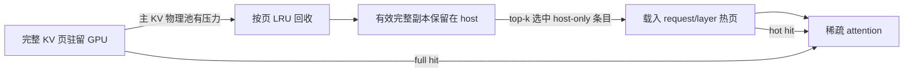

KVDuo 是面向原生稀疏注意力模型的 KV Cache 管理方案。它优先让完整 KV 驻留在 GPU；只有主稀疏 KV 物理池出现分配压力时，才回收已有最新 host 副本的冷页。稀疏注意力再次选中这些页中的条目时，resolver 按 layer 将条目载入 GPU 热页。

这种设计将普通 decode 保持在完整 KV 路径上，并在显存不足后切换为完整页、host 副本和按层热条目共存的混合驻留，从而减少整请求 retract 后重复 prefill 的开销。

## 内存模型

### 统一的 GPU 物理池

KVDuo 在主稀疏 KV 物理池中复用两种 GPU 存储：

- **完整页（full page）**：跨所有稀疏 attention layer 保存一段连续上下文的完整 KV。逻辑位置通过 full-to-physical 映射找到它。
- **热页（hot page）**：整张物理页独占归属一个 `(request, logical_layer)`，保存 resolver 最近需要的条目。

同一页号在所有 C4 存储层上的片段共同组成 KVDuo 的一张物理页。物理页始终处于 `FREE`、`FULL` 或 `HOT(request, logical_layer)` 三种互斥状态之一。KVDuo 不会把同一页号的不同存储层片段分配给不同请求。HOT 页释放后会整页返回通用 allocator，可立即用于新的 FULL 页或另一个 HOT 所有者。

一张 HOT 页的逻辑容量在运行期计算：

```text
K = C4 存储层数 × C4 压缩页大小
```

DeepSeek-V4-Flash-0731 有 21 个 C4 存储层，每层片段包含 64 个槽位，因此一张 HOT 页提供 `K = 21 × 64 = 1344` 个槽位。这里的“物理页”是 KVDuo 对相同页号的管理单位，不要求这些存储层片段位于同一张 CUDA 硬件页。



### 控制面与 CUDA 镜像

控制面维护完整页的 generation、data version、host version、最近访问时间、pin 和所有权。固定地址的 CUDA tensor 镜像向 graph replay 和 fused resolver 提供 full 映射、热页容量、LRU 槽位与统计信息；它们不是第二套所有权来源。

异步 writeback 只有在 generation 和 data version 仍匹配时才能发布 host version。这样，地址复用或原地更新后完成的旧 DMA 不会把过期 host 数据标记为有效。

## 请求生命周期

### 1. Prefill、备份与发布

Prefill 先产生完整 KV，并通过独立 CUDA stream 将数据备份到 pinned host pool。只有写满并完成备份的页才可成为回收候选；正在追加的尾页不会被当作稳定 host 副本。

Chunked prefill 支持保持开启。未完成的 chunk 仍由 request 持有，不会提前发布到 RadixTree；请求完成相应状态转换后，连续且完整驻留的前缀才进入 GPU prefix cache。

### 2. 完整驻留 decode

请求进入 decode 时不会预留热页，也不会为了迁移到 KVDuo 而复制或降级完整 KV。新 token 继续写入完整页；页封口后异步建立 host 副本。只要完整页没有被回收，resolver 直接返回 full 映射。

### 3. 物理池压力与降级

decode 新页、host 前缀恢复或必需热页即将分配时，KVDuo 按实际跨 layer 页字节数检查**主稀疏 KV 物理 allocator**。它不会使用 composite allocator 的最小可用量来推断压力，因为逻辑 token slot、SWA、indexer KV 和 compression state 分别由其他分配路径管理。

发生缺口时，处理顺序如下：

1. 等待需要完成的 producer/writeback 工作，并收集可回收的完整页。
2. 排除 Radix 前缀、当前分配显式保护的位置、请求最新的 `tail_protected_pages` 个页、未写满页，以及 host version 不是最新 data version 的页。
3. 按页内条目的最大最近访问时间执行全局页级 LRU；相同时间使用 request 和页偏移稳定排序。
4. 清除被选页的 full 映射并将物理页返回 allocator；对应请求从此进入混合驻留。
5. 完整页不足时，再按 LRU 回收**高于必需下限**的完整 HOT 页。缩容、元数据搬移和容量更新均以 `K` 个逻辑槽位为步长；归还底层 allocator 时则使用该 allocator 的基础页索引范围。

**其他请求的 decode 如何触发回收。** decode 并非每产生一个 token 都需要新的 C4 物理页：当新 token 对应的 C4 条目需要跨入下一页时，调度器才可能面对新增物理页的需求。调度器先尝试淘汰可回收的 RadixTree 缓存；随后 KVDuo 检查共享的主 C4 物理池是否有足够的整页空位。若仍有缺口，就在所有请求中寻找符合条件的历史 FULL 页，优先回收这些页；候选 FULL 页用尽后，才可能按页级 LRU 缩减任何符合条件的 `(request, logical_layer)` 中**超过必需最小容量**的 HOT 页，包括其他请求持有的热页。被选中的 HOT 页整页归还 allocator，原请求该层的容量相应减少；其余 HOT 页继续由各自请求和逻辑层独占。如果可回收页仍不够，后续分配不能直接使用不存在的物理页，而会进入现有的内存不足处理路径。这里的全局整页回收，与后文稀疏解析阶段在单个请求、单个逻辑层内部进行的热条目槽位替换，触发条件和粒度都不同。

一次真实物理分配只有在压力计划重新检查为 `SUCCESS` 后才能继续。无法取得所需页时会返回明确的压力原因或终止该分配，不会带着部分更新的元数据继续执行。

### 4. 稀疏解析与热页

模型为每层产生 top-k 逻辑位置后，resolver 按以下顺序解析：

- **full hit**：逻辑位置仍有完整页映射，直接使用该物理地址。
- **hot hit**：复用当前 `(request, logical_layer)` 独占热页中的条目，并更新 LRU。
- **host miss**：从该逻辑层的 pinned host 副本载入 KV，优先使用空槽，否则在本轮 top-k 未命中的热条目中按 LRU 选择槽位；换入目标可以位于该 HOT 页的任意 C4 存储层片段。

**热条目的槽位级 LRU。** 对每个 `(request, logical_layer)`，resolver 先找出本轮 top-k 已命中的 HOT 条目，保留其槽位并将它们更新为最近使用；命中 FULL 的位置直接读取完整页，不占 HOT 槽位。其余需要从 host 换入的条目，先复用该请求该层 HOT 页中的空槽；空槽用完后，才按条目级 LRU 替换本轮未被选中的旧条目。被替换条目的 host 副本仍可用，未来再次被选中时可以重新换入。即使该层已达到 `8K` 上限，resolver 仍通过上述槽位替换服务新的 top-k，而不会为了每次 miss 分配新页。这一过程只改写已有 HOT 页的条目及槽位映射，不归还物理页；显存压力下回收整张 HOT 页则属于前文物理池压力章节所述的页级操作。

HOT 页将一个逻辑层的槽位 `j ∈ [0, K)` 编码到连续 C4 backing 中：

```text
storage_layer = j // compressed_page_size
offset        = j % compressed_page_size
flat_location = storage_layer * layer_stride + page_start + offset
```

Host KV 仍按原逻辑层读取；只有 GPU 换入目标通过上述编码分散到不同 C4 存储层。decode resolver 对 FULL 命中加入当前逻辑层的 flat base，对 HOT 员中直接返回全局位置，因此两者可以在同一个索引表中交给 attention。非 decode prefill 的索引仍相对于当前逻辑层，所以普通 FlashMLA prefill 和独立的大 prefill 稀疏路径继续读取 `get_extra_key_buffer(layer_id)`；只有 decode 使用覆盖所有 C4 存储层的扁平 backing。

请求在首次完整页降级前保持零热页容量。进入混合驻留后，下一次 graph replay 前必须为每个逻辑层建立至少 `ceil(top_k / K)` 张 HOT 页。容量只按 `1K、2K、…、8K` 扩缩。例如 DeepSeek-V4-Flash-0731 的模型选择宽度为 512 时，一张 1344 槽 HOT 页已经足够；如果 `top_k > K`，则分配足够的整页容量，超过 `8K` 时启动失败并给出明确错误。

resolver 元数据预先固定为最多 `8K` 个槽位，以保持 CUDA Graph 的指针和形状稳定，但物理页仍按需获取。扩缩容只在 graph replay 之外的允许边界修改映射：

- 工作集立即需要更多槽位时，目标容量向上取整到下一张完整 HOT 页。
- 控制面每 8 次 replay 异步快照 host miss/valid access 计数。观察窗口内 host miss 至少为 `top_k` 且 miss rate 至少为 12.5% 时，才尝试增加一张 HOT 页。
- 统计驱动的可选扩容只使用 allocator 中已有的空闲完整物理页，不会为了可选收益回收 FULL 页。

页首索引在分配边界批量取回 CPU，最多产生一次必要的 GPU→CPU 同步；GPU 通过页首、存储层偏移和页内偏移的广播批量生成全局位置。CUDA Graph replay 本身不会引入 CPU 同步。

KVDuo 不为 newest token 暗中保留第九张 HOT 页。混合驻留时，新 token 通过正常的 FULL/HOT 位置解析进入上述容量；旧 HiSparse 路径的额外槽位不计入 KVDuo 的 HOT 页承诺。

## Host 前缀缓存与恢复

RadixTree 只表示连续 GPU 前缀，不能表示中间含 host-only 空洞的请求。KVDuo 另外维护容量受限的 host prefix cache：

- 页 identity 由 namespace、父页 identity 和当前 token chunk 构成，可在请求槽位复用后继续标识内容。
- record 保存每个 KV domain 的 host 地址与版本，并分别跟踪 request 引用、cache 引用、restore pin 和 DMA pin。
- 无引用且无 pin 的 record 才能按 LRU 淘汰；前缀匹配沿连续且版本有效的页链扩展，遇到第一个缺页或旧版本即停止。

host-only 命中不会直接交给 attention。调度器先为恢复建立 commitment 并 pin 住源 record，然后为缺失的完整页预留 GPU 资源、执行 H2D、发布 full 映射，最后释放 restore pin。资源暂时不足时恢复会延后，避免暴露半恢复的前缀。

Tensor parallel 场景下，各 rank 的 GPU 与 host 淘汰可能不同。KVDuo 会协商所有 rank 都能达到的 host 前缀终点；如果仅 GPU 命中长度不同，则重新匹配共同 GPU 前缀。所有 rank 最终以相同前缀长度进入执行。

请求结束时，只有连续、完整且版本有效的页能保留为 host 前缀。混合请求中 RadixTree 无法表达的 request-owned GPU 碎片会被释放。

## 不变量与管理边界

当前实现依赖以下不变量：

- 只有完整、页对齐、host 副本版本最新且未受保护的 full page 可以回收。
- 每张物理页只有一个 `FREE`、`FULL` 或 `HOT(request, logical_layer)` 状态；不同请求或逻辑层不能共享同一页的存储层片段。
- 完整驻留请求不持有投机热页；混合请求在 replay 前必须拥有至少 `ceil(top_k / K)` 张完整 HOT 页。
- FULL 页优先于可选 HOT 页成为压力牺牲者；HOT 容量不能缩到必需整页下限以下，且最多为八张页。
- prefill 的层内索引只读取当前逻辑层 view；decode 的 FULL/HOT 全局索引只读取扁平 C4 backing。
- prefix restore 期间源 host record 被 pin，发布前不能被淘汰。
- KVDuo 只解决主稀疏 KV 物理池压力；其他资源短缺仍由对应 allocator 或 scheduler 处理。

KVDuo 复用 HiSparse 的 host pool、稀疏 selector、resolver 和部分 allocator 接口，但改变了驻留策略：HiSparse 的共享配置由 KVDuo 在启动时生成，完整 KV 不会从一开始就被限制在固定 device buffer 中。

## 适用场景与限制

适合：

- 原生支持稀疏 KV 选择和当前 resolver/backend 的模型；
- 长上下文、高并发 decode，且主要瓶颈是主稀疏 KV 物理池；
- 工作集具有时间局部性，host pinned memory 容量和 H2D 带宽足够；
- 希望用页级降级代替整请求 retract 和重复 prefill。

不适合：

- 稠密注意力模型或没有受支持 selector/backend 的模型；
- 短上下文、低并发，完整 KV 可长期驻留 GPU；
- 瓶颈来自权重、计算、workspace、逻辑 token、SWA、indexer KV 或 compression state；
- 必须使用 speculative decoding、HiCache 或关闭 Radix cache。

## 启动与配置

在 NVIDIA CUDA 环境中，将 `MODEL_PATH` 替换为受支持的稀疏注意力模型：

```bash
python3 -m sglang.launch_server \
    --model-path MODEL_PATH \
    --tp-size 8 \
    --enable-kvduo \
    --kvduo-config='{"top_k": 2048, "host_to_device_ratio": 2, "swap_in_block_size": 960, "tail_protected_pages": 2}'
```

| 参数 | 默认值 | 作用 |
| --- | ---: | --- |
| `top_k` | `2048` | 每层 resolver 返回的选择宽度，不决定单页大小。实际最小 HOT 页数为 `ceil(top_k / K)`；DeepSeek-V4-Flash-0731 的模型 `index_topk` 为 512。 |
| `host_to_device_ratio` | `2` | host pool 相对 device pool 的容量比例。 |
| `swap_in_block_size` | `960` | resolver CUDA thread block 的线程数，不是一次 H2D 搬运的 KV 条目数；范围为 1–1024。 |
| `tail_protected_pages` | `2` | 每个请求不参与完整页回收的最新页数量。 |

所有字段必须是正整数，未知字段会报错。`--kvduo-config` 必须与 `--enable-kvduo` 一起使用。

KVDuo 要求启用 RadixTree，且不能与 `--enable-hisparse`、`--enable-hierarchical-cache` 或 speculative decoding 同时启用。KVDuo 支持 chunked prefill；启用它不会改写 `--chunked-prefill-size`。

## 评估重点

逐步增加上下文长度和并发，并同时观察：

- token throughput、TTFT、TPOT 和端到端延迟；
- retract/preemption 与重复 prefill token 数；
- FULL 页、按 `(request, logical_layer)` 独占的完整 HOT 页和 host pool 的占用；
- full/hot/host 命中分布、resolver host miss rate 和 H2D 带宽；
- 因主 KV 之外的资源不足导致的 admission 失败。

如果并发容量没有提高，先确认限制来自主稀疏 KV 物理池。如果 host miss rate 持续偏高，再检查 top-k 的时间局部性、热页可选扩容是否受物理压力限制，以及 H2D 是否成为瓶颈。
